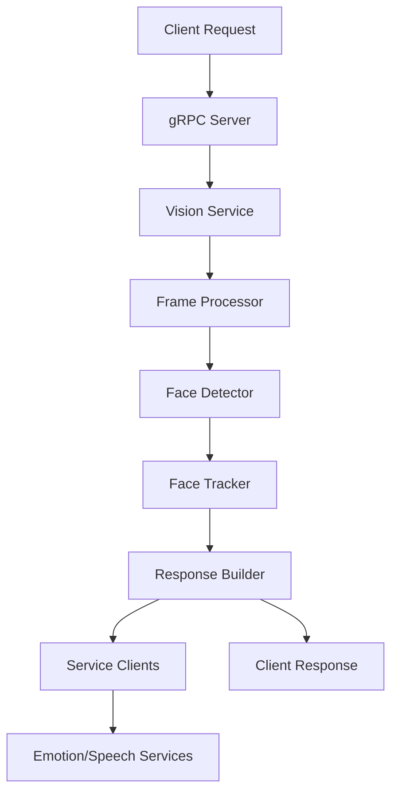

# 👁️ Vision Service Documentation

**Advanced Computer Vision Service with gRPC Architecture**

---

## 📋 Table of Contents

- [🎯 Overview](#-overview)
- [🏗️ Architecture](#️-architecture)
- [🚀 Quick Start](#-quick-start)
- [📚 API Reference](#-api-reference)
- [🔧 Configuration](#-configuration)
- [🧪 Testing](#-testing)
- [📦 Modules](#-modules)
- [🤝 Contributing](#-contributing)

---

## 🎯 Overview

Vision Service, gelişmiş bilgisayar görüsü yetenekleri sunan yüksek performanslı bir gRPC servisidir. Real-time yüz tespiti, takibi ve analizi gerçekleştirir.

### ✨ Key Features

- 🔍 **Real-time Face Detection** - Gelişmiş yüz tespit algoritmaları
- 👤 **Face Tracking** - Çoklu yüz takip sistemi
- 🎭 **Emotion Analysis** - Duygu analizi entegrasyonu
- 🗣️ **Speech Detection** - Konuşma tespiti
- ⚡ **High Performance** - Optimize edilmiş gRPC mimarisi
- 🏗️ **Modular Architecture** - Genişletilebilir modüler yapı
- 📊 **Comprehensive Logging** - Detaylı log sistemi

### 🛠️ Technologies

- **Python 3.12+**
- **OpenCV** - Computer Vision
- **gRPC** - High-performance RPC framework
- **dlib** - Face landmark detection
- **NumPy** - Numerical computing

---

## 🏗️ Architecture

### 📁 Project Structure

```
vision-service/
├── 📄 vision_server.py          # Entry point
├── 📁 modules/                  # Core modules
│   ├── 📁 config/              # Configuration management
│   │   ├── config_manager.py   # Environment & app config
│   │   ├── grpc_config.py      # gRPC settings
│   │   └── logger_config.py    # Logging setup
│   ├── 📁 vision/              # Computer vision modules
│   │   ├── face_detector.py    # Face detection algorithms
│   │   ├── face_tracker.py     # Multi-face tracking
│   │   └── frame_processor.py  # Frame processing pipeline
│   ├── 📁 network/             # Network & communication
│   │   ├── grpc_server.py      # gRPC server management
│   │   ├── service_client.py   # External service clients
│   │   └── response_builder.py # Response object builder
│   └── 📁 core/                # Business logic
│       └── vision_service.py   # Main service implementation
├── 📁 proto/                   # Protocol Buffers
├── 📁 docs/                    # Documentation
└── 📁 logs/                    # Log files
```

### 🔄 Data Flow



---

## 🚀 Quick Start

### 📋 Prerequisites

```bash
# Python 3.12+
python --version

# Required models (download to project root)
# - haarcascade_frontalface_default.xml
# - shape_predictor_68_face_landmarks.dat
```

### ⚙️ Installation

```bash
# Clone repository
git clone <repository-url>
cd vision-service

# Install dependencies
pip install -r requirements.txt

# Setup environment
cp .env.example .env
# Edit .env with your configurations
```

### 🏃‍♂️ Running the Service

```bash
# Start the service
python vision_server.py

# Service will be available at:
# gRPC: 0.0.0.0:50051
```

### 📊 Health Check

```python
import grpc
import proto.vision_pb2 as vision_pb2
import proto.vision_pb2_grpc as vision_pb2_grpc

# Connect to service
channel = grpc.insecure_channel('localhost:50051')
stub = vision_pb2_grpc.VisionServiceStub(channel)

# Test with sample image
with open('sample.jpg', 'rb') as f:
    image_data = f.read()

request = vision_pb2.VisionRequest(image=image_data)
response = stub.AnalyzeFrame(request)

print(f"Faces detected: {len(response.faces)}")
```

---

## 📚 API Reference

### 🎯 VisionService

#### `AnalyzeFrame`

Analyze a single image frame for face detection and tracking.

**Request:**

```protobuf
message VisionRequest {
    bytes image = 1;
}
```

**Response:**

```protobuf
message VisionResponse {
    bool person_detected = 1;
    repeated DetectedFace faces = 2;
}

message DetectedFace {
    string id = 1;
    int32 x = 2;
    int32 y = 3;
    int32 width = 4;
    int32 height = 5;
    repeated float landmarks = 6;
    bytes face_image = 7;
}
```

**Example:**

```python
response = stub.AnalyzeFrame(vision_pb2.VisionRequest(image=image_data))
for face in response.faces:
    print(f"Face ID: {face.id}, Position: ({face.x}, {face.y})")
```

---

## 🔧 Configuration

### 🌍 Environment Variables

Create a `.env` file in the project root:

```env
# gRPC Server Configuration
GRPC_HOST=0.0.0.0
GRPC_PORT=50051
GRPC_MAX_WORKERS=10

# Face Detection Thresholds
FACE_MATCH_THRESHOLD=0.7
FACE_CLEANUP_TIMEOUT=5.0

# Model Paths
CASCADE_PATH=haarcascade_frontalface_default.xml
MODEL_PATH=shape_predictor_68_face_landmarks.dat

# External Services
EMOTION_SERVICE_HOST=localhost
EMOTION_SERVICE_PORT=50052
SPEECH_SERVICE_HOST=localhost
SPEECH_SERVICE_PORT=50053

# Logging
LOG_LEVEL=INFO
LOG_FILE=logs/vision_service.log
DEBUG_MODE=false
```

### ⚙️ Advanced Configuration

See [Configuration Guide](./configuration.md) for detailed settings.

---

## 🧪 Testing

### Unit Tests

```bash
python -m pytest tests/unit/
```

### Integration Tests

```bash
python -m pytest tests/integration/
```

### Performance Tests

```bash
python -m pytest tests/performance/
```

---

## 📦 Modules

### 🔧 Config Module

- **ConfigManager**: Environment and application configuration
- **GrpcConfig**: gRPC server settings
- **LoggerConfig**: Logging setup and management

### 👁️ Vision Module

- **FaceDetector**: Advanced face detection algorithms
- **FaceTracker**: Multi-face tracking with ID assignment
- **FrameProcessor**: Complete frame processing pipeline

### 🌐 Network Module

- **GrpcServer**: gRPC server lifecycle management
- **ServiceClient**: External service communication
- **ResponseBuilder**: Response object construction

### 🎯 Core Module

- **VisionService**: Main business logic implementation

---

## 🤝 Contributing

1. Fork the repository
2. Create a feature branch (`git checkout -b feature/amazing-feature`)
3. Commit your changes (`git commit -m 'Add amazing feature'`)
4. Push to the branch (`git push origin feature/amazing-feature`)
5. Open a Pull Request

### 📝 Code Style

- Follow PEP 8
- Add type hints
- Write comprehensive docstrings
- Include unit tests

---

## 📄 License

This project is licensed under the MIT License - see the [LICENSE](../LICENSE) file for details.

---

## 📞 Support

- 📧 Email: support@visionservice.com
- 💬 Discord: [Vision Service Community](https://discord.gg/visionservice)
- 🐛 Issues: [GitHub Issues](https://github.com/your-repo/vision-service/issues)

---

**Made with ❤️ by the Vision Service Team**
